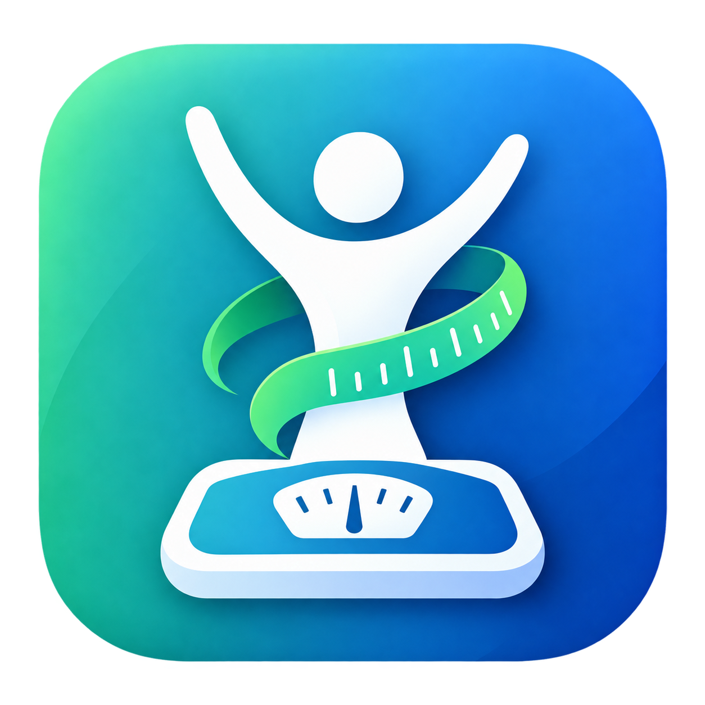

<div align="center">
  

  # HealthScale

  ### A modern, colorful BMI and wellness snapshot app built with Flutter.

  
  
  
</div>

---

## 🌟 Overview

**HealthScale** is a polished BMI calculator with a colorful minimal interface, branded splash screen, custom app icons, and an upgraded health summary experience.

The app helps users quickly calculate BMI and view helpful wellness information such as BMI category, healthy weight range, estimated daily maintenance calories, and practical next-step suggestions.

---

## ✨ Features

- 🎨 Modern colorful glass-style UI
- 🚀 Branded splash screen with HealthScale logo
- 📱 Custom Android, iOS, and web app icons
- ⚖️ BMI calculation from height and weight
- 👤 Male/Female profile selection
- 🏃 Activity level selection: Light, Active, Athlete
- 📊 Result screen with BMI gauge
- 🎯 Healthy BMI and target weight range
- 🔥 Estimated daily maintenance calories
- ✅ Personalized wellness suggestions
- 🔄 Reset button for quick input refresh
- 📐 Responsive layout for phone, tablet, web, and desktop

---

## 🖼️ App Logo

The app uses the HealthScale logo from:

```text
assets/images/healthscale-logo.png
```

This logo is used for:

- App splash screen
- App header branding
- Android launcher icon
- iOS app icons
- Web favicon and PWA icons

---

## 🧩 Tech Stack

| Technology | Purpose |
| --- | --- |
| Flutter | Cross-platform UI framework |
| Dart | App programming language |
| Material 3 | App theme foundation |
| Font Awesome Flutter | Gender and control icons |
| Android Gradle Plugin | Android build system |

---

## 📁 Project Structure

```text
lib/
  components/
    app_background.dart
    bottom_button.dart
    icon_content.dart
    reusable_card.dart
    round_icon_button.dart
  screens/
    input_page.dart
    results_page.dart
    splash_screen.dart
  calculator_brain.dart
  constants.dart
  main.dart

assets/
  images/
    healthscale-logo.png

android/
ios/
web/
windows/
linux/
macos/
```

---

## 🚀 Getting Started

### 1. Clone the project

```bash
git clone <your-repository-url>
cd bmi_calculator
```

### 2. Install dependencies

```bash
flutter pub get
```

### 3. Run the app

```bash
flutter run
```

To run on a specific device:

```bash
flutter devices
flutter run -d <device-id>
```

Examples:

```bash
flutter run -d chrome
flutter run -d emulator-5554
```

---

## 🧪 Quality Checks

Run analyzer:

```bash
flutter analyze
```

Run tests:

```bash
flutter test
```

Build Android debug APK:

```bash
flutter build apk --debug
```

Generated APK:

```text
build/app/outputs/flutter-apk/app-debug.apk
```

---

## 🛠️ Android Notes

This project uses the modern Flutter Gradle plugin setup.

If Android build fails because of Gradle memory, check:

```text
android/gradle.properties
```

Current setting:

```properties
org.gradle.jvmargs=-Xmx4096M -XX:MaxMetaspaceSize=1024m -Dfile.encoding=UTF-8
```

If `flutter run` fails during install with:

```text
Requested internal only, but not enough space
```

wipe or free storage on the Android emulator:

```text
Android Studio > Device Manager > Pixel Tablet > Wipe Data
```

---

## 🎯 BMI Categories

| BMI Range | Category |
| --- | --- |
| Below 18.5 | Underweight |
| 18.5 - 24.9 | Normal |
| 25.0 - 29.9 | Overweight |
| 30.0 and above | Obesity |

> BMI is a general screening tool and not a medical diagnosis. For personal health decisions, consult a qualified healthcare professional.

---

## 🌈 Design Direction

HealthScale uses a minimal colorful style with:

- Dark gradient background
- Soft glow accents
- Glass-style cards
- Bright teal, pink, blue, and warm yellow highlights
- Rounded controls
- Clean typography
- Branded splash experience

---

## 📌 Current Verification

The project has been verified with:

```text
flutter analyze
flutter test
flutter build apk --debug
```

Expected result:

```text
No issues found
All tests passed
Built build/app/outputs/flutter-apk/app-debug.apk
```

---

## 👨‍💻 Author

Created as a Flutter BMI Calculator project and redesigned into **HealthScale**.

---

<div align="center">
  Made with Flutter 💙
</div>
